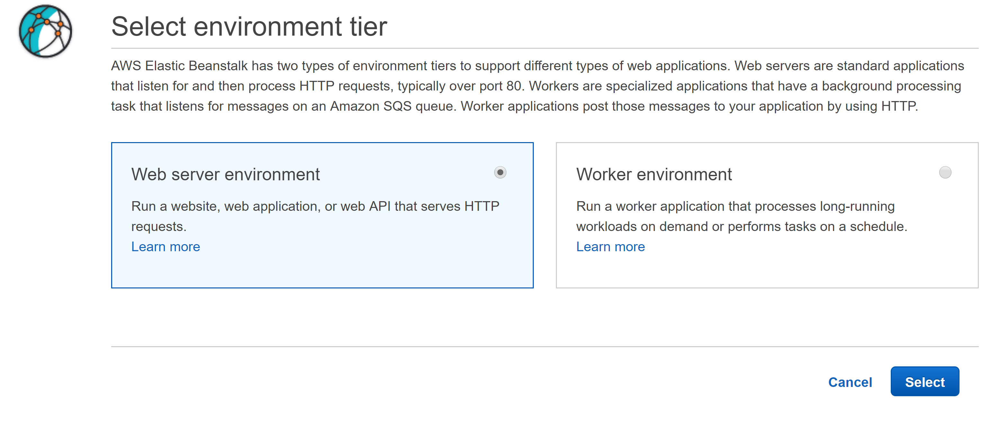
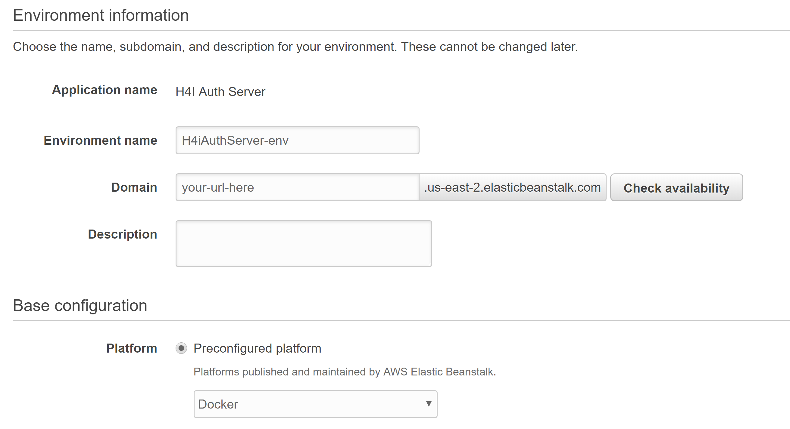
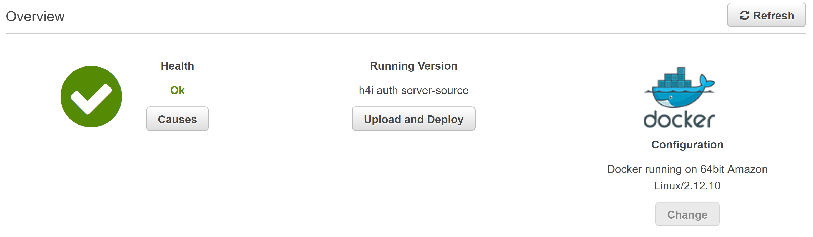

# H4i Infrastructure Authentication Server

Guide for integrating into your App: https://docs.google.com/document/d/1K6e9jarVtAync-Bti6BN6bKI-8JnvwK4IZmhlTSn2pg/edit

# Links

Documentation: https://h4i-auth-infra-docs.now.sh/

API: https://github.com/hack4impact-uiuc/infra-authentication-api/

Client Example: https://github.com/hack4impact-uiuc/infra-authentication-client

# To Run Locally

```
yarn
yarn start
```

# Deployment

**AWS Elastic Beanstalk:**

1. Create an AWS account and go to the [Elastic Beanstalk website](https://console.aws.amazon.com/elasticbeanstalk/home) (note that you may be charged)
2. Create a new Elastic Beanstalk application, along with a web server environment
   
3. Select Docker as the configuration and upload Dockerized server code as a .zip file
   
4. After a few minutes (and resolving any potential errors), your server should be deployed
   

```
Tips:
- Remember to EXPOSE the server port in the Dockerfile
- Ensure the uploaded .zip contains the source code files directly (i.e. the Dockerfile should be visible as soon as the zip is uncompressed).
- Ensure the uploaded .zip contains your .env file
```
