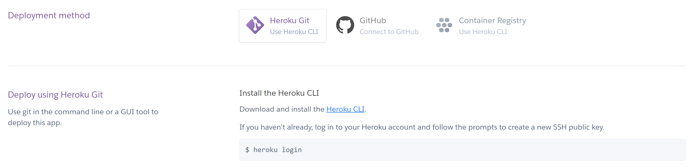
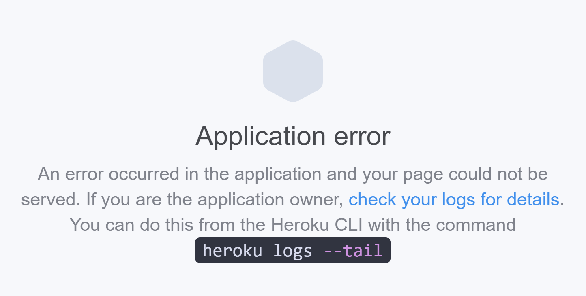
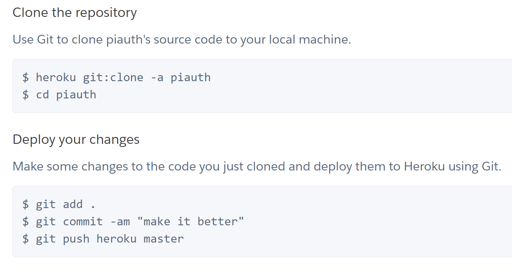

# H4i Infrastructure Authentication Server

Guide for integrating into your App: https://docs.google.com/document/d/1K6e9jarVtAync-Bti6BN6bKI-8JnvwK4IZmhlTSn2pg/edit

# Links

Documentation: https://h4i-auth-infra-docs.now.sh/

API: https://github.com/hack4impact-uiuc/infra-authentication-api/

Client Example: https://github.com/hack4impact-uiuc/infra-authentication-client

# To Run Locally

```
yarn
yarn start
```

# Deployment

## AWS Elastic Beanstalk

1. Create an AWS account and go to the [Elastic Beanstalk website](https://console.aws.amazon.com/elasticbeanstalk/home) (note that you may be charged)
2. Create a new Elastic Beanstalk application, along with a web server environment
   
3. Select Docker as the configuration and upload Dockerized server code as a .zip file. Since there's a Dockerfile already, all you need to do is save the authentication server project folder as a zip file and upload it here.
   
4. After a few minutes (and resolving any potential errors), your server should be deployed
   

Tips:

- Remember to EXPOSE the server port in the Dockerfile by adding: `EXPOSE 8000`. You can replace `8000` with whatever local port you're using.
- Ensure the uploaded .zip contains the source code files directly (i.e. the Dockerfile should be visible as soon as the zip is uncompressed).
- Ensure the uploaded .zip contains your .env file

---

## AWS Amplify:

- [Amplify](https://aws-amplify.github.io/docs/) already has amazing documentation and detailed step-by-step instructions for how to set up
- Note that React applications must be created with [create-react-app](https://github.com/facebook/create-react-app)

---

## Heroku

1. Create a [Heroku account](https://www.heroku.com/) and [a new project](https://dashboard.heroku.com/apps).
2. Select a deployment method of your choice.
   - If you choose to use Heroku Git, you will have to install the [Heroku CLI tool](https://devcenter.heroku.com/articles/heroku-cli) and follow the given instructions to deploy your code to Heroku.
   - Alternatively, you can choose to use GitHub directly and link Heroku to your GitHub project.



Tips:

- In your startServer.js file, insert process.env.PORT as an additional port. Heroku uses a random port, so inserting this allows you to deploy both on Heroku and locally. For example, the following allows you to test your code locally on localhost:8000 while retaining the functionality of your Heroku deployment:

```
app.listen(process.env.PORT || 8000)
```



- Note that syncing changes using the CLI tool can be tedious if you are deploying mid-development, so it is recommended to deploy either at the very beginning or end. You have to clone the Heroku repository and make/commit your changes there for them to reflect on the deployment.
  
- You can turn the deployment offline/online with the following command:

```
Offline:
heroku ps:scale web=0

Online:
heroku ps:scale web=1
```
